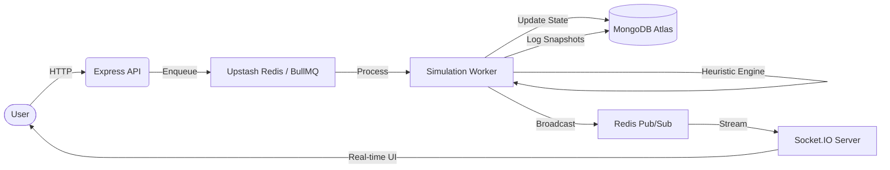

# CascadeX
### Distributed Fault-Agnostic Simulation & Propagation Engine

CascadeX is a high-performance distributed simulation engine designed to model complex system failures and resource-based propagation within interconnected neural graphs. Unlike traditional event-driven simulations, CascadeX utilizes a low-latency, worker-based state machine to guarantee atomicity and deterministic consistency across distributed environments.

---

## System Overview

CascadeX provides an infrastructure-agnostic environment for stress-testing large-scale architectures. By defining systems as a directed graph of nodes (services, databases, infrastructure components) and edges (dependencies, network routes), users can trigger synthetic failures and observe real-time cascade effects. The engine is engineered to handle massive state transitions without compromising the integrity of the underlying data model.

## Architecture Overview

The system is built on a decoupled, event-driven micro-architecture designed for horizontal scalability and high availability.

### High-Level System Design

- **Persistent Layer**: MongoDB Atlas serves as the primary source of truth for project configurations, graph topologies, and user authentication.
- **State Synchronization**: Upstash Redis acts as the high-speed transit layer, managing the work queue (BullMQ) and the real-time Pub/Sub adapter for Socket.IO.
- **Execution Engine**: A dedicated BullMQ Worker processes simulation "ticks" atomically, ensuring that resource calculations and failure evaluations are decoupled from the API lifecycle.
- **Real-Time Pipeline**: Socket.IO provides bi-directional, persistent connections to clients, streaming simulation state updates and analytics directly from the execution layer.
- **Frontend Dashboard**: A React-based SPA providing high-fidelity visualization, graph management, and deep-forensic replay capabilities.

### Core Engine Components

1. **Deterministic State Machine**: Manages the resource lifecycle of each node. Each simulation tick processes state transitions (Resource Decay, Threshold Evaluation, and Edge-Based Propagation) based on fixed mathematical heuristics.
2. **Propagator Service**: Calculates the "force" of a failure. When a node fails, the propagator evaluates outgoing edges, applying weighted resource hits to dependent targets in a recursive yet controlled manner.
3. **Forensics Engine**: Captures point-in-time snapshots of the entire graph state at every tick, allowing for full state replay and post-simulation analysis.

## Simulation Lifecycle

1. **Initialization**: The user specifies an injection point (initial node failure).
2. **Queue Ingestion**: The API enqueues a simulation start job into Redis.
3. **Tick Execution**: The BullMQ Worker picks up the job, retrieves the current graph state, and executes the heuristic logic.
4. **State Persistence**: The new state is written to the history collection and the current status is updated in Redis.
5. **Real-time Broadcast**: The Worker emits a `simulation_update` event via the Redis Pub/Sub layer.
6. **Cycle Completion**: The job re-enqueues itself for the next tick until the system reaches a stable state (quiescence) or is manually terminated.

## System Flow Diagram

## AI Analysis Layer: Deterministic Heuristic Engine

CascadeX deliberately implements a **Deterministic Heuristic Engine** for risk assessment rather than a traditional Large Language Model (LLM).

**Why Heuristics over LLMs?**
- **Precision**: In architecture stress-testing, "hallucinations" or non-deterministic outputs are catastrophic. Heuristics guarantee that given the same graph and same failure, the result is identical every time.
- **Latency**: Real-time simulation requires sub-100ms evaluation loops. Heuristic calculations are orders of magnitude faster than token-based inference.
- **Transparency**: Every AI-driven "insight" in CascadeX is traceable to a specific dependency path or resource threshold, providing auditable technical justifications.

## Security & Access Control

- **JWT-Based Authorization**: Stateless authentication using secure JSON Web Tokens.
- **Super Admin Override**: Robust role-based access control (RBAC) allowing administrators to manage any project or simulation within the cluster.
- **Environment-Aware CORS**: Dynamic origin validation strictly enforcing production/development boundaries.
- **Atomic Locking**: Redis-backed concurrency control to prevent race conditions during simultaneous simulation management.

## Tech Stack Breakdown

- **Backend**: Node.js, Express, Socket.IO, BullMQ, IORedis.
- **Frontend**: React, React Router, CSS Glassmorphism, Skeleton Loading UI.
- **Database**: MongoDB (Mongoose ODM).
- **Caching/Queuing**: Managed Redis (Upstash).
- **Deployment**: Render (Backend), Netlify (Frontend).

## Production Infrastructure & Scalability

CascadeX is designed to operate in high-concurrency environments. By utilizing a **Distributed Socket Adapter**, the real-time layer can scale horizontally across multiple instances while remaining synchronized via the Redis Pub/Sub backbone. The separation of the API and Simulation Worker ensures that heavy simulation workloads do not degrade the performance of the user management or graph editing interfaces.

## Future Improvements

- **Native Clustering Support**: Dynamic node groups for even larger scale topologies.
- **Terraform Integration**: Exporting graph states as IaC templates.
- **Predictive Auto-Healing**: Using simulation data to suggest automated infrastructure scaling parameters.

---

### Resume-Ready Summary

CascadeX is a full-stack distributed simulation platform built to solve the challenge of complex dependency modeling. It leverages a modern event-driven architecture, implementing high-performance state synchronization via Redis and BullMQ to handle real-time propagation logic. This project demonstrates mastery of distributed systems, real-time data streaming, and professional-grade infrastructure engineering.
"Deployment config"  
